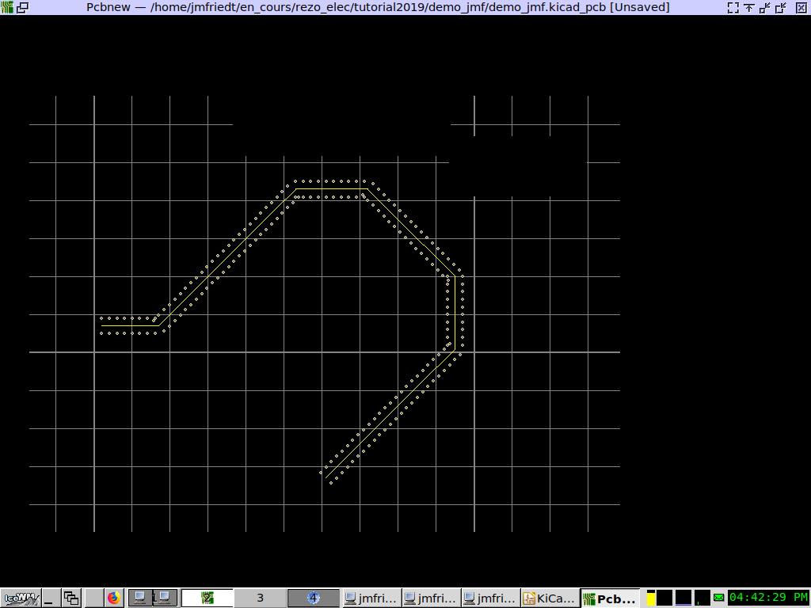

# kicad_transmissionline
KiCAD transmission line: adds vias around a wire propagating a radiofrequency signal

copy files in /usr/share/kicad/scripting/plugins/

Tools -> External Plugin -> Refresh Plugins

In PCBNew: draw Track

Select Track

Tools -> External Plugin -> TransmissionLine

  

