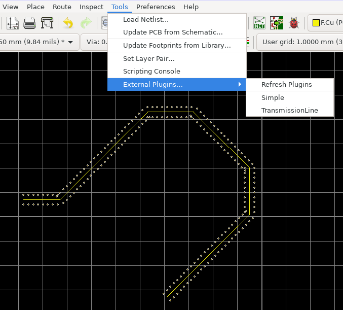

# kicad_transmissionline
KiCAD transmission line: adds vias around a wire propagating a radiofrequency signal

copy files in /usr/share/kicad/scripting/plugins/ (GNU/Linux)

Tools -> External Plugin -> Refresh Plugins to load the plugin. An icon should appear on the top bar of the graphical interface.

In PCBNew: draw Track

Select Track

Tools -> External Plugin -> TransmissionLine to decorate the transmission line with vias. The distance between vias and from the track to vias is defined as constants in the Python script: could be improved with menus if I knew how to do so. Default behaviour is to assign the vias to the GND net and connect from bottom to top copper layers.

  

No claim to be working under all conditions, and most probably some vias will overlap at straight line intersections, requring manual cleaning of overlapping vias (compare transmission_cleaned.png vs transmission.png). Could probably be improved.
